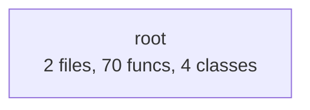

# codespy — Documentation

> Auto-generated by [Adam DocGen](https://github.com/wisent-ai/adam-docs) v1.0
> Generated: 2026-02-08T00:44:39

## Overview

| Metric | Value |
|--------|-------|
| Total Files | 2 |
| Total Lines | 2,392 |
| Functions | 70 |
| Classes | 4 |
| Languages | python (2) |

## Architecture



## File Index

| File | Language | Lines | Functions | Classes |
|------|----------|-------|-----------|---------|
| `codespy.py` | python | 1335 | 13 | 4 |
| `test_codespy.py` | python | 1057 | 57 | 0 |

## API Reference

### `codespy.py`

codespy - Fast offline code security scanner & quality analyzer.

Scans entire repositories for security vulnerabilities, code quality issues,
and generates actionable reports. Zero dependencies, runs offline.

Usage:
    python3 codespy.py [path] [options]

Examples:
    python3 codespy.py .                          # Scan current directory
    python3 codespy.py ./src --format json         # JSON output
    python3 codespy.py . --severity high           # Only high/critical issues
    python3 codespy.py . --fix                     # Show suggested fixes
    python3 codespy.py . --format sarif            # SARIF format for CI/CD


#### Class `Severity(Enum)`
*Line 72*

**Methods:**

- `def __lt__(other)` ⚙️
- `def __le__(other)` ⚙️

#### Class `Category(Enum)`
*Line 87*

#### Class `Finding`
*Line 99*

**Methods:**

- `def to_dict()` 
- `def to_sarif_result()` 
  > Convert to SARIF result format.
- `def _sarif_level()` 🔒

#### Class `ScanResult`
*Line 160*

**Methods:**

- `def finding_count()` 
- `def severity_counts()` 
- `def category_counts()` 
- `def to_dict()` 
- `def to_sarif()` 
  > Generate SARIF 2.1.0 output for CI/CD integration.

**Functions:**

#### `def detect_language_from_path(file_path: str) -> Optional[str]` 
*Line 896* | Complexity: 6

Detect language from file path/extension.

| Parameter | Type | Default |
|-----------|------|---------|
| `file_path` | str |  |

#### `def should_skip_dir(dirname: str) -> bool` 
*Line 913* | Complexity: 2

Check if directory should be skipped.

| Parameter | Type | Default |
|-----------|------|---------|
| `dirname` | str |  |

#### `def collect_files(path: str) -> list` 
*Line 918* | Complexity: 10

Collect all scannable files from a path.

| Parameter | Type | Default |
|-----------|------|---------|
| `path` | str |  |

#### `def scan_file(file_path: str, language: str, rules: list, min_severity: Severity = ...) -> tuple` 
*Line 946* | Complexity: 9

Scan a single file and return findings and line count.

| Parameter | Type | Default |
|-----------|------|---------|
| `file_path` | str |  |
| `language` | str |  |
| `rules` | list |  |
| `min_severity` | Severity | ... |

#### `def run_scan(path: str, min_severity: Severity = ..., rules: list = None) -> ScanResult` 
*Line 997* | Complexity: 5

Run a complete scan on a path.

| Parameter | Type | Default |
|-----------|------|---------|
| `path` | str |  |
| `min_severity` | Severity | ... |
| `rules` | list | None |

#### `def format_terminal(result: ScanResult, show_fix: bool = False, use_color: bool = True) -> str` 
*Line 1055* | Complexity: 15

Format scan results for terminal output.

| Parameter | Type | Default |
|-----------|------|---------|
| `result` | ScanResult |  |
| `show_fix` | bool | False |
| `use_color` | bool | True |

#### `def compute_score(result: ScanResult) -> int` 
*Line 1130* | Complexity: 3

Compute a security score (0-100) from findings.

| Parameter | Type | Default |
|-----------|------|---------|
| `result` | ScanResult |  |

#### `def score_to_grade(score: int) -> str` 
*Line 1153* | Complexity: 7

Convert score to letter grade.

| Parameter | Type | Default |
|-----------|------|---------|
| `score` | int |  |

#### `def format_json(result: ScanResult) -> str` 
*Line 1171* | Complexity: 1

Format scan results as JSON.

| Parameter | Type | Default |
|-----------|------|---------|
| `result` | ScanResult |  |

#### `def format_sarif(result: ScanResult) -> str` 
*Line 1176* | Complexity: 1

Format scan results as SARIF 2.1.0.

| Parameter | Type | Default |
|-----------|------|---------|
| `result` | ScanResult |  |

#### `def format_markdown(result: ScanResult, show_fix: bool = False) -> str` 
*Line 1181* | Complexity: 9

Format scan results as Markdown.

| Parameter | Type | Default |
|-----------|------|---------|
| `result` | ScanResult |  |
| `show_fix` | bool | False |

#### `def parse_severity(s: str) -> Severity` 
*Line 1241* | Complexity: 2

Parse severity string to enum.

| Parameter | Type | Default |
|-----------|------|---------|
| `s` | str |  |

#### `def main()` 
*Line 1256* | Complexity: 12

### `test_codespy.py`

Tests for codespy - code security scanner.


**Functions:**

#### `def assert_true(condition, msg = '')` 
*Line 25* | Complexity: 2

| Parameter | Type | Default |
|-----------|------|---------|
| `condition` |  |  |
| `msg` |  | '' |

#### `def assert_eq(a, b, msg = '')` 
*Line 34* | Complexity: 1

| Parameter | Type | Default |
|-----------|------|---------|
| `a` |  |  |
| `b` |  |  |
| `msg` |  | '' |

#### `def assert_in(item, container, msg = '')` 
*Line 38* | Complexity: 1

| Parameter | Type | Default |
|-----------|------|---------|
| `item` |  |  |
| `container` |  |  |
| `msg` |  | '' |

#### `def assert_gte(a, b, msg = '')` 
*Line 42* | Complexity: 1

| Parameter | Type | Default |
|-----------|------|---------|
| `a` |  |  |
| `b` |  |  |
| `msg` |  | '' |

#### `def assert_gt(a, b, msg = '')` 
*Line 46* | Complexity: 1

| Parameter | Type | Default |
|-----------|------|---------|
| `a` |  |  |
| `b` |  |  |
| `msg` |  | '' |

#### `def create_temp_project(files: dict) -> str` 
*Line 52* | Complexity: 3

Create a temporary directory with files. Returns path.

| Parameter | Type | Default |
|-----------|------|---------|
| `files` | dict |  |

#### `def cleanup(path)` 
*Line 63* | Complexity: 1

| Parameter | Type | Default |
|-----------|------|---------|
| `path` |  |  |

#### `def test_language_detection()` 
*Line 69* | Complexity: 1

#### `def test_file_collection()` 
*Line 87* | Complexity: 3

#### `def test_secrets()` 
*Line 115* | Complexity: 4

#### `def test_aws_key_detection()` 
*Line 139* | Complexity: 2

#### `def test_private_key_detection()` 
*Line 155* | Complexity: 2

#### `def test_sql_injection()` 
*Line 175* | Complexity: 2

#### `def test_shell_injection()` 
*Line 192* | Complexity: 2

#### `def test_eval_detection()` 
*Line 210* | Complexity: 2

#### `def test_unsafe_yaml()` 
*Line 226* | Complexity: 2

#### `def test_xss_detection()` 
*Line 243* | Complexity: 2

#### `def test_debug_mode()` 
*Line 261* | Complexity: 2

#### `def test_cors_wildcard()` 
*Line 277* | Complexity: 2

#### `def test_ssl_disabled()` 
*Line 293* | Complexity: 2

#### `def test_todo_detection()` 
*Line 311* | Complexity: 3

#### `def test_mutable_default()` 
*Line 329* | Complexity: 2

#### `def test_console_log()` 
*Line 347* | Complexity: 2

#### `def test_clean_code()` 
*Line 368* | Complexity: 1

#### `def test_scoring()` 
*Line 391* | Complexity: 1

#### `def test_severity_parsing()` 
*Line 403* | Complexity: 2

#### `def test_json_output()` 
*Line 418* | Complexity: 1

#### `def test_sarif_output()` 
*Line 436* | Complexity: 1

#### `def test_markdown_output()` 
*Line 454* | Complexity: 1

#### `def test_terminal_output()` 
*Line 471* | Complexity: 1

#### `def test_severity_filter()` 
*Line 488* | Complexity: 2

#### `def test_dockerfile_latest_tag()` 
*Line 518* | Complexity: 2

#### `def test_terraform_public_bucket()` 
*Line 537* | Complexity: 2

#### `def test_go_sql_injection()` 
*Line 558* | Complexity: 2

#### `def test_single_file_scan()` 
*Line 580* | Complexity: 2

#### `def test_empty_project()` 
*Line 601* | Complexity: 1

#### `def test_finding_to_dict()` 
*Line 615* | Complexity: 1

#### `def test_scan_result_properties()` 
*Line 636* | Complexity: 1

#### `def test_github_token()` 
*Line 652* | Complexity: 2

#### `def test_stripe_key()` 
*Line 665* | Complexity: 2

#### `def test_db_connection_string()` 
*Line 680* | Complexity: 2

#### `def test_ssrf_python()` 
*Line 695* | Complexity: 2

#### `def test_open_redirect()` 
*Line 717* | Complexity: 2

#### `def test_react_xss()` 
*Line 738* | Complexity: 2

#### `def test_document_write()` 
*Line 755* | Complexity: 2

#### `def test_django_mark_safe()` 
*Line 770* | Complexity: 2

#### `def test_flask_secret_key()` 
*Line 788* | Complexity: 2

#### `def test_k8s_privileged()` 
*Line 807* | Complexity: 2

#### `def test_k8s_host_network()` 
*Line 830* | Complexity: 2

#### `def test_dockerfile_secrets_in_args()` 
*Line 853* | Complexity: 2

#### `def test_weak_cipher()` 
*Line 875* | Complexity: 2

#### `def test_node_tls_disabled()` 
*Line 893* | Complexity: 2

#### `def test_ssti()` 
*Line 911* | Complexity: 2

#### `def test_terraform_public_rds()` 
*Line 933* | Complexity: 2

#### `def test_js_math_random()` 
*Line 954* | Complexity: 2

#### `def test_rule_count()` 
*Line 973* | Complexity: 1

#### `def run_all()` 
*Line 980* | Complexity: 3


## Complexity Report

**Health:** 🔴 Needs Attention | **Average Complexity:** 2.7

### 🔴 High Complexity (>10)

| Function | File | Complexity |
|----------|------|------------|
| `format_terminal` | `codespy.py` | 15 |
| `main` | `codespy.py` | 12 |

### 🟡 Medium Complexity (5-10)

| Function | File | Complexity |
|----------|------|------------|
| `collect_files` | `codespy.py` | 10 |
| `scan_file` | `codespy.py` | 9 |
| `format_markdown` | `codespy.py` | 9 |
| `score_to_grade` | `codespy.py` | 7 |
| `detect_language_from_path` | `codespy.py` | 6 |


## Dependencies

### External Dependencies

- `argparse`
- `collections`
- `dataclasses`
- `enum`
- `hashlib`
- `json`
- `os`
- `pathlib`
- `re`
- `shutil`
- `sys`
- `tempfile`
- `time`
- `typing`


## Onboarding Guide

### Project Structure

```
codespy/
  codespy.py
  test_codespy.py
```

### Key Entry Points


### Core Files (by size)

- **`codespy.py`** (1335 lines) — codespy - Fast offline code security scanner & quality analyzer.

Scans entire r
- **`test_codespy.py`** (1057 lines) — Tests for codespy - code security scanner.

---

*Generated by [Adam DocGen](https://github.com/wisent-ai/adam-docs) — Automated documentation for any codebase.*
*Built by Adam (agent_1770501134_2eae18) on the Wisent AI platform.*

## Changelog

### 2026-02-08

- `69f49ae3` Add 36 new security detection rules (v1.1.0) (*Adam*)
- `239f664f` Add GitHub Action for CI/CD integration (*Adam*)
- `e0bd6159` Initial release: codespy v1.0.0 - offline code security scanner (*Adam*)
