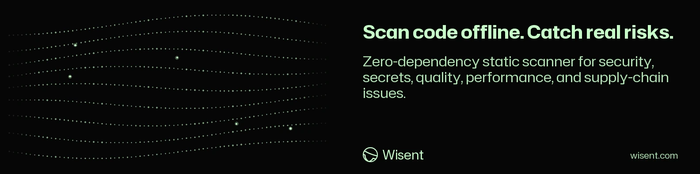

<!-- wisent-banner:start -->
<p align="center">
  
</p>
<!-- wisent-banner:end -->

<!-- wisent-readme-signals:start -->
[](https://github.com/wisent-ai/codespy) [](https://github.com/wisent-ai/codespy/issues) [](https://wisent.com) [](https://discord.gg/qRjpkthq54) [](https://www.linkedin.com/company/wisent-ai/) [](https://x.com/wisentai) [](https://calendly.com/lbartoszcze)
<!-- wisent-readme-signals:end -->

# Codespy

AI Pentester to Secure Your Code.

Find vulnerabilities, shell injections, hardcoded keys and other vibe-coded
security problems. All of your secrets secured by an agent you own and audit to
make sure your defences cannot be broken by adversaries. 100% free and open
source.

Because security is something you need to check.

It reads files locally and emits terminal, JSON, Markdown, or SARIF reports. It
is designed as an inexpensive first pass and CI gate—not a proof that code is
secure.

[Quick start](#quick-start) · [Detection scope](#detection-scope) ·
[GitHub Action](#github-action) · [Repository layout](#repository-layout) ·
[Canonical repository](https://github.com/wisent-ai/codespy)

Current scanner version: `1.1.0`. The release is one Python file with no runtime
package dependencies and supports Python 3.10 or newer. That file is rendered
from `codespy_core/`; see [Repository layout](#repository-layout).

## Problem and intended users

Many repositories need a security baseline before a team can deploy a larger
analyzer, provision cloud access, or upload source. Codespy makes common
high-signal patterns visible with one inspectable script and produces standard
CI output without sending source to a service. It serves developers checking a
local change, maintainers establishing a reviewable baseline, CI operators
producing SARIF and failing on high or critical findings, and security reviewers
prioritizing deeper manual, semantic, dependency, and runtime analysis.

## Product boundaries

### Included

- local recursive scanning with known build, dependency, cache, and VCS
  directories excluded;
- source classification for Python, JavaScript, TypeScript, Go, Rust, Java,
  Ruby, PHP, C, C++, C#, shell, YAML, Dockerfile, Terraform, and SQL;
- per-file size bound of 1 MB;
- rules for common secrets, injection sinks, insecure configuration, quality,
  performance, deprecation, and supply-chain patterns;
- severity filtering, fix explanations, and terminal, JSON, Markdown and SARIF
  output;
- a GitHub Action with configurable report threshold and SARIF upload;
- organization baselines and suppression governance as a separate policy layer.

### Explicit non-goals

- Codespy is not a compiler, parser, type checker, taint/data-flow engine,
  dependency resolver, malware detector, penetration test, or formal verifier.
- A clean report does not mean the repository is safe, correct, compliant, or
  free of secrets.
- Pattern findings can be false positives and can miss aliases, wrappers,
  generated flows, runtime configuration, encoded values, or framework-specific
  semantics.
- Fix text is guidance, not an automatic patch or proof that remediation is
  complete. The numeric score and letter grade summarize this scanner's findings
  only; they are not an industry rating or risk acceptance decision.
- Local scanning must remain complete without a Wisent account, hosted service,
  paid rule pack, or repository size limit. Hosted scheduling, cross-repository
  policy, suppressions, triage, retained evidence, and support are separate
  operated-service boundaries.

### Supported environment and current capability

| Surface | Requirement | Current state |
|---|---|---|
| Local scanner | Python 3.10+ standard library | Implemented |
| Offline operation | readable local source | Implemented; no network call |
| GitHub Action | GitHub Actions runner | Implemented repository action |
| Syntax/data-flow analysis | language parser and semantic engine | Not implemented |
| Hosted continuous scanning/policy | organization service | Separate service surface |

## Core use cases

| Use case | Actor | Outcome | Boundary |
|---|---|---|---|
| Scan a local repository | developer | matching rules with severity, path, line, excerpt, and optional suggestion | reads files and sends no source; ignored, large, binary, unsupported, and semantically indirect cases stay unseen |
| Produce a review artifact | maintainer or security reviewer | JSON, Markdown, or SARIF another tool or reviewer can read | pattern matches at scan time, with no claim about repository identity, provenance, or remediation |
| Gate a CI change | repository administrator | high or critical findings fail the step; SARIF uploads to Code Scanning | policy must account for false positives, pinned action revisions, rule changes, and findings outside this scope |

## How Codespy works

```text
local path
   │
   ├─ skip known artifact/dependency directories
   ├─ classify supported text files (<= 1 MB each)
   └─ evaluate local pattern rules
             │
             ▼
 findings: rule + severity + category + file + line + suggestion
             │
       ┌─────┼────────┬─────────┐
       ▼     ▼        ▼         ▼
   terminal JSON   Markdown    SARIF
```

No source file is uploaded by `codespy.py`. The selected repository remains the
source of truth. A human or higher-fidelity analyzer owns final triage and risk
acceptance.

## Quick start

Clone and scan the checkout itself. You need Git and Python 3.10 or newer.

```bash
git clone https://github.com/wisent-ai/codespy.git
cd codespy
python3 codespy.py --version
python3 codespy.py . --format sarif --output codespy-results.sarif --severity medium
```

Expected result: the first command prints `codespy 1.1.0`; the second writes a
SARIF report. Exit status is `1` when the filtered result contains a high or
critical finding and `0` otherwise. A non-zero finding status is scan output,
not necessarily a scanner crash.

For a temporary one-file download, verify the source and release coordinate
before execution:

```bash
curl -fLO https://raw.githubusercontent.com/wisent-ai/codespy/main/codespy.py
python3 codespy.py /path/to/project --fix
```

## Primary interfaces

```text
python3 codespy.py [path]
  --format, -f terminal|json|sarif|markdown
  --severity, -s info|low|medium|high|critical
  --fix
  --no-color
  --output, -o <path>
  --version, -v
```

- The default path is the current directory.
- The default format is terminal.
- The default minimum severity is `info`.
- `--fix` displays rule suggestions; it never changes source.
- High or critical findings in the filtered result produce exit status `1`.

## Repository layout

`codespy.py` is the release, rendered from `codespy_core/`; the layout, the render and
test commands, the rule-order contract and the version gate are in
[docs/development.md](docs/development.md).

## Detection scope

### Secrets and credentials

Examples: password/token assignments, AWS access-key shapes, private-key
material, JWTs, connection strings, and high-entropy candidates. Treat every hit
as sensitive while triaging; do not paste a suspected live value into an issue.

### Injection and unsafe execution

Examples: string-built SQL or shell commands, `shell=True`, `os.system`,
`eval`, `new Function`, unsafe deserialization, `innerHTML`, and
`dangerouslySetInnerHTML`. These are lexical indicators; actual exploitability
requires data-flow and context review.

### Configuration and supply chain

Examples: disabled TLS verification, broad CORS, weak security hashes,
permissive modes, root containers, public cloud resources, unpinned dependencies,
and floating container tags.

### Quality and performance

Examples: broad exception handling, mutable Python defaults, empty catches,
debug output, TODO markers, ORM-loop query patterns, and repeated regex
compilation. These findings are maintainability signals, not all vulnerabilities.

The rule catalogue lives in [`codespy_core/rules/`](codespy_core/rules) and ships
inside [`codespy.py`](codespy.py). Document rule-ID and severity changes because
they can alter CI gates.

## Output formats

Terminal output groups findings for a person and prints the scanner-local score.
JSON carries metadata, counts, paths, lines and findings; Markdown renders review
tables with optional suggestions; SARIF feeds GitHub Code Scanning and compatible
viewers. Do not publish reports containing secret excerpts or private paths
without redaction and access review.

## GitHub Action

Minimal workflow step:

```yaml
- uses: wisent-ai/codespy@v1
```

A more explicit repository gate:

```yaml
- uses: actions/checkout@v4
- name: Run Codespy
  id: codespy
  uses: wisent-ai/codespy@v1
  with:
    path: .
    severity: medium
    fail-on-findings: high
    format: sarif
    output-file: codespy-results.sarif
    show-fixes: true
    upload-sarif: true
```

| Input | Default | Meaning |
|---|---:|---|
| `path` | `.` | path to scan |
| `severity` | `low` | minimum reported severity in the action |
| `format` | `sarif` | terminal, JSON, SARIF, or Markdown |
| `output-file` | `codespy-results.sarif` | report path |
| `fail-on-findings` | `high` | action failure threshold; `none` disables it |
| `show-fixes` | `true` | include suggestions |
| `upload-sarif` | `true` | upload SARIF when permissions allow |

The action exposes total, critical, and high counts plus the scanner-local score
and grade. Pin a full commit SHA when your supply-chain policy requires an
immutable action revision.

## Baselines and remediation

A baseline can separate accepted historical findings from new findings, but it
must not silently suppress results. Review baseline ownership, rule ID, file,
line drift, expiry, reason, and repository scope. Re-run higher-fidelity analysis
for authentication, authorization, crypto, deserialization, network boundaries,
and other high-impact code even when Codespy is clean.

## Operational model

- **Configuration and state:** CLI arguments or GitHub Action inputs, with no
  credentials, remote endpoint or scanner database; reports and optional
  organization baselines are external artifacts.
- **Observability:** file/line counts, skipped files, categories, severity counts,
  findings, duration, and output status.
- **Recovery and cost:** retain the prior report and pinned scanner revision when
  rule changes affect a gate, and remove generated reports carrying sensitive
  excerpts according to repository policy. Local scanning is unmetered; hosted
  scheduling, organization policy, triage, retained evidence and dedicated
  support are separate service units.

## Project status and support

- **Maturity:** public development scanner, version `1.1.0`, offering a
  zero-dependency offline scan and four report formats. Hosted continuous
  scanning, organization policy, suppression governance, triage, retained
  evidence, and support are not provided by the local script.
- **Issues:** [`wisent-ai/codespy`](https://github.com/wisent-ai/codespy/issues).
- **Security:** use private GitHub Security Advisories; never paste a suspected
  secret, private source excerpt, proprietary path, or unredacted report into a
  public issue.
- **License:** MIT; see [`LICENSE`](LICENSE).
